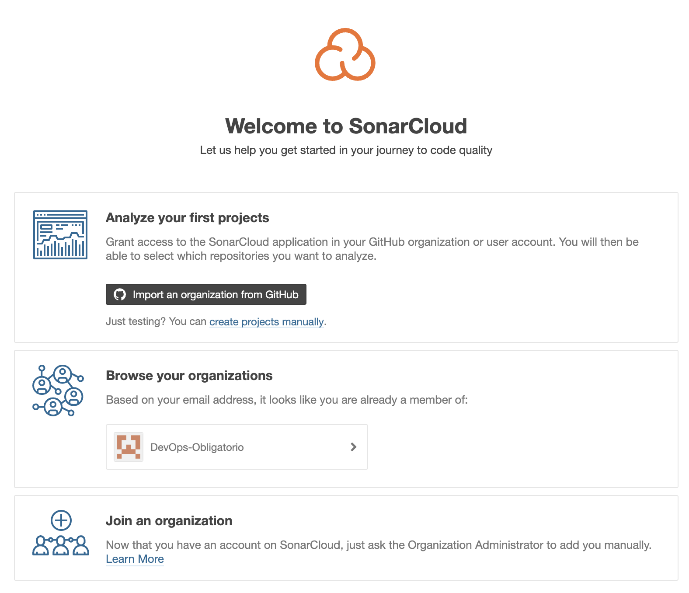

# Documentación Obligatorio DevOps

En el presente documento se demuestran los avances, decisiones y observaciones referentes al Proyecto Integrador con su correspondiente referencia.

# 2.a Creación de ambientes para microservicios

Se utilizaron los microservicios propuestos por el Docente. Los cuatro microservicios fueron subidos a repositorios independientes y con sus correspondientes ramas: `main`, `Develop`, `Testing` y `feature`.

Esto fue siguiendo una metodología de trabajo basada en Gitflow según se muestra en el diagrama a continuación.

Observar que se ejemplifica un caso de testing rechazado el cual se continúa el desarrollo sobre la rama de la funcionalidad original y luego de aprobado el test, se procede a ejecutar el `merge` a la rama `develop` a traves de un `pull request` que deberá ser aprobado por 

A continuación se listan los enlaces para cada repositorio de microservicio:

- [payments-service-example][2] 
- [orders-service-example][3]
- [shipping-service-example][4]
- [products-service-example][5]

Como se podrá observar, ese conjunto de repositorios se encuentra en una Organización creada para agrupar también la documentación y el repositorio de infraestructura o DevOps.

# 2.b Empaquetado en containers y despliegue en AWS

## Build Microservicios
Se detectó la necesidad de resolver un conflicto en los puertos que los diferentes microservicios utilizaban (`8080`). 

1. Eliminar el ejecutable  `.jar`
2. En `src/main/resources/` modificar `application.properties` agregar `sever.port=808x`
3. Correr el comando `mvn clean package --file pom.xml` en la raíz del proyecto del microservicio
4. Obtener la ruta del nuevo ejecutable según indique la salida del comando anterior.
5. Con la ruta, completar el archivo `maven-docker-ecr.yml`

Esta limitante se debe a una funcionalidad no permitida (`port-mapping`) por fargate. ??

A su vez para el microservicio de `orders-service-example` se debió modificar 

## AWS

Se optó por utilizar los sevicios de nube ofrecidos para el curso en la plataforma de AWS Academy Learner Lab. Para utilizar estos servico se deben seguir los siguientes pasos:

1. Ingresar en la web de [AWS Academy][6]
2. 

### AWS - ECS
CPU units 1
Security Group creado por defecto queda
52.147.230.223

### Setup ECS

### Setup ECR

### Requisitos de red: Subnet, Security Groyp, Route Table y NAT Gateway

## Docker Hub

Pasos para hacer `push` a una imagen local a `Docker Hub`
- `docker login`
- Crear imagen `docker build --build-arg JAR_FILE=orders-service-example.jar -t orders-service-example:1 .`

- `docker tag shipping-service-example:1 shipping-service-1`
- `docker push lucasdock/devops-ort:obl`

## Github Actions

Se utiliza el servicio `Github Actions`. Cada `push` de `git` en la rama `Testing` es un disparador.

Ver `.github/worflows` - se ejecutan varios en paralelo
Ver Docker Hub
Ver Sonarcloud.io

# 2.c Aplicación de tests y registro de resultados

## Sonarcloud

En la web de [SonarCloud][7] se procede de la siguient forma

- Registro e inicio de sesion
- Detección de oranización de Obligatorio
- Generación de Secret Token para conectar repositorios correctamente
- Desactivar `Automatic Analaysis` porque da conflicto con automatización mediante `Terraform` 
- También

# 2.d Análisis de código estático, registro de resultados y recomentaciones.

# 2.e Utilización de Git y GitFlow para el ciclo de desarrollo.

# 2.f Documentación de toda la implementación

Este paso se cumple en el presente documento.

# 2.g Diagrama CI/CD

De acuerdo a la configuración decidida por el equipo, un diagrama de Continous Integration y Continous Delivery podría representarse como en la siguiente imagen.

## 2.h Manejo de IaC en AWS

### Terraform
1. Crear archivo `main.tf`
2. Para inicializarlo correr `terraform init` en el mismo directorio del `main.tf`
3. Una vez finalizado, correr `terraform validate`
4. Una vez finalizado, correr `terraform plan`
5. Finalmente `terraform apply`

En este punto debería verse el avance de los procesos del lado de AWS.

Observar:
- En `Amazon ECS/Clusters` observar `myapp-cluster`
- En `my-app-service` se encontrarán las `tasks`
- Y finalmente 3 contenedores en estado `running`

## 2.i Acceso al equipo docente

Para brindar acceso de sólo lectura al equipo docente se procede a agregar con rol `Member?` al usuario `ElLargo` dentro de la organización [DevOps-Obligatorio][1] la cual contiene los repositorios y documentación necesarias para la correcta evaluación.

[1]: https://github.com/DevOps-Obligatorio
[2]: https://github.com/DevOps-Obligatorio/payments-service-example
[3]: https://github.com/DevOps-Obligatorio/orders-service-example
[4]: https://github.com/DevOps-Obligatorio/shipping-service-example
[5]: https://github.com/DevOps-Obligatorio/products-service-example
[6]: https://www.awsacademy.com/LMS_Login
[7]: https://www.sonarcloud.io