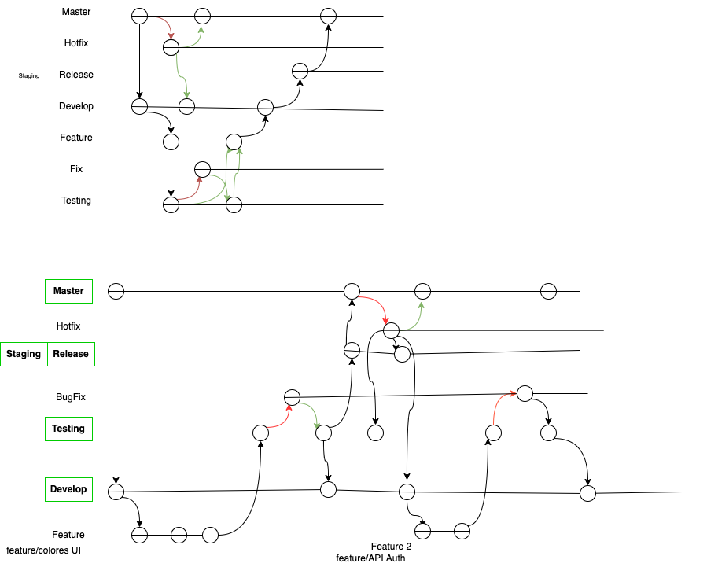
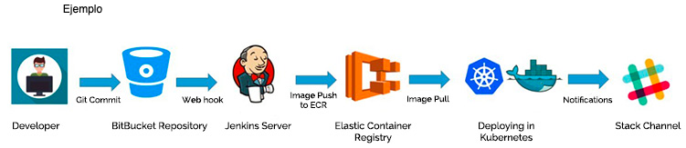

# Documentación

En el presente documento se demuestran los avances, decisiones y observaciones referentes al Proyecto Integrador con su correspondiente referencia.

---

## 2.a Creación de ambientes para microservicios

Se utilizaron los microservicios propuestos por el Docente. Los cuatro microservicios fueron subidos a repositorios independientes y con sus correspondientes ramas: `main`, `Develop`, `Testing` y `Staging`.

Esto fue siguiendo una metodología de trabajo basada en Gitflow según se muestra en el diagrama a continuación.



A continuación se listan los enlaces para cada repositorio de microservicio:

- [payments-service-example][2] 
- [orders-service-example][3]
- [shipping-service-example][4]
- [products-service-example][5]

Observar que en primera instancia, en cada repositorio se agregaron las cuatro ramas a utilizar siguiendo la metodología Gitflow. Mediante un comando `git branch -a` se pueden ver todas las ramas:

```
* main
  remotes/origin/Develop
  remotes/origin/HEAD -> origin/main
  remotes/origin/Staging
  remotes/origin/Testing
  remotes/origin/main
```


## 2.b Empaquetado en containers y despliegue en AWS


## 2.c Aplicación de tests y registro de resultados


## 2.d Análisis de código estático, registro de resultados y recomentaciones.

## 2.e Utilización de Git y GitFlow para el ciclo de desarrollo.

## 2.f Documentación de toda la implementación

Este paso se cumple en el presente documento.

## 2.g Diagrama CI/CD

De acuerdo a la configuración decidida por el equipo, un diagrama de Continous Integration y Continous Delivery podría representarse como en la siguiente imagen.



## 2.h Manejo de IaC en AWS

## 2.i Acceso al equipo docente

Para brindar acceso de sólo lectura al equipo docente se procede a agregar con rol `Member?` al usuario `ElLargo` dentro de la organización [DevOps-Obligatorio][1] la cual contiene los repositorios y documentación necesarias para la correcta evaluación.


[1]: https://github.com/DevOps-Obligatorio
[2]: https://github.com/DevOps-Obligatorio/payments-service-example
[3]: https://github.com/DevOps-Obligatorio/orders-service-example
[4]: https://github.com/DevOps-Obligatorio/shipping-service-example
[5]:https://github.com/DevOps-Obligatorio/products-service-example