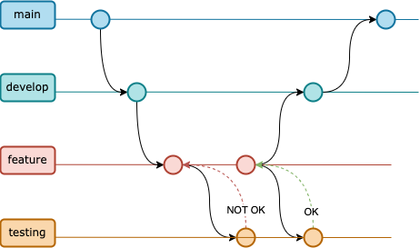

# Documentación Obligatorio DevOps

En el presente documento se demuestran los avances, decisiones y observaciones referentes al Proyecto Integrador con su correspondientes referencias.

# 2.a Creación de ambientes para microservicios

**Se utilizaron los microservicios propuestos por el Docente. Los cuatro microservicios fueron subidos a repositorios independientes y con sus correspondientes ramas:** `main`, `Develop` y `Testing`.

La metodología de trabajo basada en Gitflow para el repositorio de `infraestructura` siguió las pautas según se muestra en el diagrama a continuación.

Se diseño un proceso de trabajo básico en la cual el ambiente de producción `main`, diera partida al ambiente de `develop` y éste a su vez sirva de raíz para cada nueva feature que se desarrollara. En el diagrama se busca mostrar un caso en el que el testing es rechazado y la feature debe seguir siendo desarrollada hasta aprobada pore le test uniatrio. Una vez logrado esto, se buscaría hacer un `merge` contra `develop`.

La realidad es que no hubo tal simultaneidad en el desarrollo de features pues se trabajó en cojunto en cada feature. Sin embargo, se buscó garantizar el trabajo de ambos participantes mediante dos formas: 
- la generación de `commits` de ambos usuarios y 
- la implementación de `pull requests` buscando validar y aprobar el avance entre pares.

Por otra parte, se entiende que el diagrama planteado no es del todo completo ni mucho menos infalible para un equipo de mayores dimensiones. Por lo que a continuación se planteará un diagrama basado en gitflow pero que contemple un entorno más profesional y aplicable en equipos de mayor porte.

Observar que se agrega otro caso de ejemplo de feature con simples fines ilustrativos y que a su vez, se demuestra la forma asincrónica en que `develop` recibe `pull request` a ser a probados entre pares una vez la feature aprueba el test unitario particular.

Contemplando que se trata de una metodología de trabajo con etapas bien definidas, se agregó también un ambiente de `QA` en donde se ejecutarán pruebas sobre el sistema pero esta vez no apuntando a test unitarios sino que globales (por ejemplo, test de regresión, de integración y de rendimiento)

**Aclaraciones del diagrama**

En la etapa de `QA` pueden detectarse problemas a solucionar los cuales entendemos es conveniente tratarlos como un `FIX` de una `feature` por lo que el equipo de desarrollo, tendrá que trabajar sobre una nueva rama como si fuera una feature nueva volviendo al ciclo inicial.

También pueden ocurrir fallos en el ambiente de `staging` o en `main`. Por el lado de la falla en `staging` se entiende es conveniente tratarlo de igual forma que `QA` pues no es de urgencia. Si embargo, siendo el ambiente de producción el más crítico, se entiende debería existir un `HOTFIX` concreto para la falla detectada. La introcducción de un `HOTFIX` debe a su vez, ""bajar" al ambiente de `develop` para garantizar que en algún momento el `HOTFIX` introducido pase por `QA`.

## Enlaces a repositorios de microservicios.

A continuación se listan los enlaces para cada repositorio de microservicio:

- [payments-service-example][2] 
- [orders-service-example][3]
- [shipping-service-example][4]
- [products-service-example][5]

Como se podrá observar, ese conjunto de repositorios se encuentra en una Organización de Github creada para agrupar también la documentación y el repositorio de infraestructura o DevOps.

# 2.b Empaquetado en containers y despliegue en AWS

## Build Microservicios
Se detectó la necesidad de resolver un conflicto en los puertos que los diferentes microservicios utilizaban (`8080`). 

1. Eliminar el ejecutable  `.jar`
2. En `src/main/resources/` modificar `application.properties` agregar `sever.port=808x`
3. Correr el comando `mvn clean package --file pom.xml` en la raíz del proyecto del microservicio
4. Obtener la ruta del nuevo ejecutable según indique la salida del comando anterior.
5. Con la ruta, completar el archivo `maven-docker-ecr.yml`

Esta limitante se debe a una funcionalidad no permitida (`port-mapping`) por fargate. ??

A su vez para el microservicio de `orders-service-example` se debió modificar 

## AWS

Se optó por utilizar los sevicios de nube ofrecidos para el curso en la plataforma de AWS Academy Learner Lab. Para utilizar estos servico se deben seguir los siguientes pasos:

1. Ingresar en la web de [AWS Academy][6]
2. 

### AWS - ECS
CPU units 1
Security Group creado por defecto queda
52.147.230.223

### Setup ECS

### Setup ECR

### Requisitos de red: Subnet, Security Groyp, Route Table y NAT Gateway

## Docker Hub

Pasos para hacer `push` a una imagen local a `Docker Hub`
- `docker login`
- Crear imagen `docker build --build-arg JAR_FILE=orders-service-example.jar -t orders-service-example:1 .`

- `docker tag shipping-service-example:1 shipping-service-1`
- `docker push lucasdock/devops-ort:obl`

## Github Actions

Se utiliza el servicio `Github Actions`. Cada `push` de `git` en la rama `Testing` es un disparador.

Ver `.github/worflows` - se ejecutan varios en paralelo
Ver Docker Hub
Ver Sonarcloud.io

# 2.c Aplicación de tests y registro de resultados

## Postman

Cada Microservicio soporta las siguientes peticiones a través de sus endpoints:

- Orders: `POST` (a revisar)
- Products: `GET`
- Shipping: `GET` (a revisar)

# 2.d Análisis de código estático, registro de resultados y recomentaciones.

## Sonarcloud

En la web de [SonarCloud][7] se procede de la siguient forma

- Registro e inicio de sesion
- Detección de oranización de Obligatorio
- Generación de Secret Token para conectar repositorios correctamente
- Desactivar `Automatic Analysis` porque da conflicto con automatización mediante `Terraform` 
- También

Para detectar que SonarCloud está respondiendo a modificaciones posibles del código fuente, se ajustaron los umbrales de aceptación de forma conveniente y que permitiera detectar facilmente su reacción a los cambios. Por ejemplo, se mostrará el ajuste del `Quality Gate` llamado `Duplicated Lines (%)` el cual analiza 

# 2.e Utilización de Git y GitFlow para el ciclo de desarrollo.

# 2.f Documentación de toda la implementación

Este paso se cumple en el presente documento.

# 2.g Diagrama CI/CD

De acuerdo a la configuración decidida por el equipo, un diagrama de Continous Integration y Continous Delivery podría representarse como en la siguiente imagen.

## 2.h Manejo de IaC en AWS

### Terraform
1. Crear archivo `main.tf`
2. Para inicializarlo correr `terraform init` en el mismo directorio del `main.tf`
3. Una vez finalizado, correr `terraform validate`
4. Una vez finalizado, correr `terraform plan`
5. Finalmente `terraform apply`

En este punto debería verse el avance de los procesos del lado de AWS.

Observar:
- En `Amazon ECS/Clusters` observar `myapp-cluster`
- En `my-app-service` se encontrarán las `tasks`
- Y finalmente 3 contenedores en estado `running`

## 2.i Acceso al equipo docente

Para brindar acceso de sólo lectura al equipo docente se procede a agregar con rol `Member?` al usuario `ElLargo` dentro de la organización [DevOps-Obligatorio][1] la cual contiene los repositorios y documentación necesarias para la correcta evaluación.

[1]: https://github.com/DevOps-Obligatorio
[2]: https://github.com/DevOps-Obligatorio/payments-service-example
[3]: https://github.com/DevOps-Obligatorio/orders-service-example
[4]: https://github.com/DevOps-Obligatorio/shipping-service-example
[5]: https://github.com/DevOps-Obligatorio/products-service-example
[6]: https://www.awsacademy.com/LMS_Login
[7]: https://www.sonarcloud.io