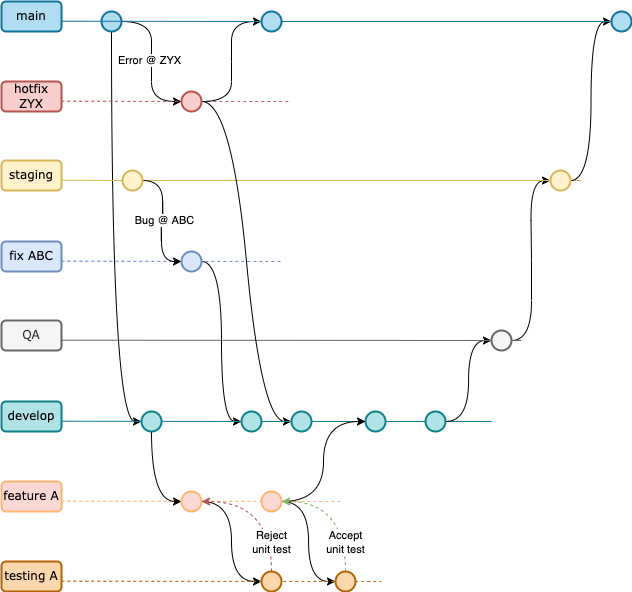

# Documentación Obligatorio DevOps

En el presente documento se demuestran los avances, decisiones y observaciones referentes al Proyecto Integrador con su correspondientes referencias.

# 2.a Creación de ambientes para microservicios

Se utilizaron los microservicios propuestos por el Docente. Los cuatro microservicios fueron subidos a repositorios independientes y con sus correspondientes ramas: `main`, `Develop` y `Testing`.

## Enlaces a repositorios de microservicios.

A continuación se listan los enlaces para cada repositorio de microservicio:

- [payments-service-example][2] 
- [orders-service-example][3]
- [shipping-service-example][4]
- [products-service-example][5]

Como se podrá observar, ese conjunto de repositorios se encuentra en una Organización de Github creada para agrupar también la [documentación][8] y el repositorio de [infraestructura][9] o DevOps.

# 2.b Empaquetado en containers y despliegue en AWS

## Arquitectura de Servicios en AWS

En el diagrama se muestra la solución desplegada en un cluster `ECS` con `Fargate`. 

Se agregó un load balancer para repartir la carga entre los microservicios.

El `ECR Registry` es utilizado para subir y disponibilizar la imagen de los contenedores de cada microservicio.

A su vez, para dar conectividad por internet, se agregó el `internet gateway` con su correspontiente `NAT gateway` y esto habilitó la comunicación a través de internet a los siquientes puertos:
- Products Service `8080`
- Payments Service `8081`
- Shipping Service `8082`
- Orders Service `8083`

### Docker Hub

Como backup, se utilizó Docker Hub para subir las imagenes de los contenedores en paralelo a AWS.

# 2.c Testeo y resultados con Postman

Cada Microservicio soporta las siguientes peticiones a través de sus endpoints:

- Orders: `POST` (a revisar)
- Products: `GET`
- Shipping: `GET` (a revisar)

Para realizar pruebas básicas, se procedió mediante la ejecución de las siguientes pruebas manuales:

# 2.d Análisis de código estático, resultados y recomendaciones.

## Sonarcloud

En la web de [SonarCloud][7] se procede de la siguient forma

- Registro e inicio de sesion
- Detección de oranización de Obligatorio
- Generación de Secret Token para conectar repositorios correctamente
- Desactivar `Automatic Analysis` porque da conflicto con automatización mediante `Terraform` 
- También

Para detectar que SonarCloud está respondiendo a modificaciones posibles del código fuente, se ajustaron los umbrales de aceptación de forma conveniente y que permitiera detectar facilmente su reacción a los cambios. Por ejemplo, se mostrará el ajuste del `Quality Gate` llamado `Duplicated Lines (%)` el cual analiza 

# 2.e Utilización de Git y GitFlow para el ciclo de desarrollo.

La metodología de trabajo basada en Gitflow para el repositorio de `infraestructura` siguió las pautas según se muestra en el diagrama a continuación.

Se diseño un proceso de trabajo básico en la cual el ambiente de producción `main`, diera partida al ambiente de `develop` y éste a su vez sirva de raíz para cada nueva feature que se desarrollara. En el diagrama se busca mostrar un caso en el que el testing es rechazado y la feature debe seguir siendo desarrollada hasta aprobada pore le test uniatrio. Una vez logrado esto, se buscaría hacer un `merge` contra `develop`.

La realidad es que no hubo tal simultaneidad en el desarrollo de features pues se trabajó en cojunto en cada feature. Sin embargo, se buscó garantizar el trabajo de ambos participantes mediante dos formas: 
- la generación de `commits` de ambos usuarios y 
- la implementación de `pull requests` buscando validar y aprobar el avance entre pares.

Por otra parte, se entiende que el diagrama planteado no es del todo completo ni mucho menos infalible para un equipo de mayores dimensiones. Por lo que a continuación se planteará un diagrama basado en gitflow pero que contemple un entorno más profesional y aplicable en equipos de mayor porte.

Contemplando que se trata de una metodología de trabajo con etapas bien definidas, se agregó también un ambiente de `QA` en donde se ejecutarán pruebas sobre el sistema pero esta vez no apuntando a test unitarios sino que globales (por ejemplo, test de regresión, de integración y de rendimiento)

En la etapa de `QA` pueden detectarse problemas a solucionar los cuales entendemos es conveniente tratarlos como un `FIX` de una `feature` por lo que el equipo de desarrollo, tendrá que trabajar sobre una nueva rama como si fuera una feature nueva volviendo al ciclo inicial.

También pueden ocurrir fallos en el ambiente de `staging` en cuyo caso se entiende conveniente tratarlo de forma similar que `QA` pues no es de urgencia. Si el `FIX` es tratado independiente, y no se maneja como una feature nueva, debe volver a hacer un `merge` con `develop` para garantizar que los cambios del fix, quedan aplicados al flujo de "subida" herárquica. 

Por último pero no menos imporatnte, el ambiente `main` es el ambiente de producción, y toda falla ocurrida aquí debería se corregida en un `HOTFIX` concreto y con urgencia. 

La introcducción de un `HOTFIX` debe a su vez, "bajar" al ambiente de `develop` para garantizar que en algún momento el `HOTFIX` introducido forme parte del core de desarrollo.

# 2.f Documentación de toda la implementación

Este paso se cumple en el presente documento.

# 2.g Diagrama CI/CD

De acuerdo a la configuración decidida por el equipo, un diagrama de Continous Integration y Continous Delivery podría representarse como en la siguiente imagen.

En el diagrama se muestra el proceso desde el trabajo de un desarrollador que genera un `PUSH` hacia `Github` en una rama dada (en el caso programado `testing`).

# 2.h Manejo de IaC en AWS

### Terraform
1. Crear archivo `main.tf`
2. Para inicializarlo correr `terraform init` en el mismo directorio del `main.tf`
3. Una vez finalizado, correr `terraform validate`
4. Una vez finalizado, correr `terraform plan`
5. Finalmente `terraform apply`

En este punto debería verse el avance de los procesos del lado de AWS.

### Bloques de código

- Networking
- AWS
- ...

### Github Actions

Se utiliza el servicio `Github Actions` para que cada `push` de `git` en la rama `Testing` dispare las acciones de CI/CD.

En cada repositorio de microservicio, se puede ver en el siguiente path `.github/worflows` lo configurado.

# 2.i Acceso al equipo docente

Para brindar acceso de sólo lectura al equipo docente se procede a agregar con rol `Member?` a los usuarios [ElLargo][10], [mauricioamendola][11] y [saitama-dh][12] dentro de la organización [DevOps-Obligatorio][1] la cual contiene los repositorios y documentación necesarias para la correcta evaluación.

[1]: https://github.com/DevOps-Obligatorio
[2]: https://github.com/DevOps-Obligatorio/payments-service-example
[3]: https://github.com/DevOps-Obligatorio/orders-service-example
[4]: https://github.com/DevOps-Obligatorio/shipping-service-example
[5]: https://github.com/DevOps-Obligatorio/products-service-example
[6]: https://www.awsacademy.com/LMS_Login
[7]: https://www.sonarcloud.io
[8]: https://github.com/DevOps-Obligatorio/documentacion
[9]: https://github.com/DevOps-Obligatorio/infraestructura
[10]: https://github.com/ElLargo
[11]: https://github.com/mauricioamendola
[12]: https://github.com/saitama-dh